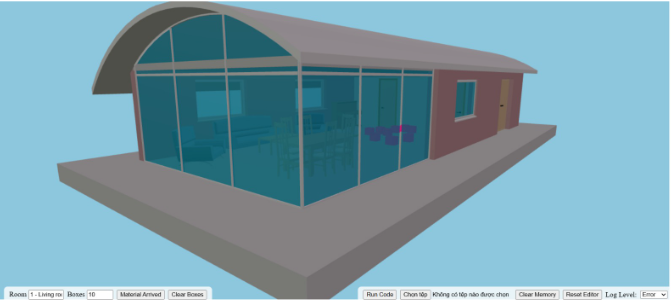

# BOMBIM_material_arrivals

```bash
git@github.com:Chi147/BOMBIM_material_arrivals.git
````

## Description

This module visualizes material arrivals on a construction site within a BIM model.
It uses an IFC 3D viewer (web-ifc) to display **hot pink boxes** that represent delivered materials.

## Features

* Load and view IFC models
* Render hot pink bounding boxes for material arrivals
* Real-time visual indication directly in the BIM scene

## Requirements

* Node.js
* npm

## Installation & Run

1. Install dependencies:

```bash
npm install
```

2. Navigate to the viewer directory:

```bash
cd engine_web-ifc/
```

3. Start the development server:

```bash
npm run dev
```

4. Open the local link shown in the terminal (for example `http://localhost:xxxx/`) to access the web-ifc viewer.

## How to Use (Load IFC + Show Boxes)

1. In the viewer, click **Choose File** (or the file upload button).
2. Select the sample IFC file:

   * `ifc4_SampleHouse.ifc`
3. In the input box labeled **Room**, enter one of the following options:

   * `1 - Living room`
   * `2 - Bedroom`
   * `3 - Entrance hall`
4. In the input box labeled **Boxes**, enter the desired number of boxes (example: `10`).
5. Click **Material arrived** to generate and display the hot pink boxes.
6. Click **Clear boxes** to remove all boxes from the scene.


## Notes

* All logic is implemented on the frontend
* Material arrivals are represented visually only
* Ensure you are inside `engine_web-ifc` before running the dev server
